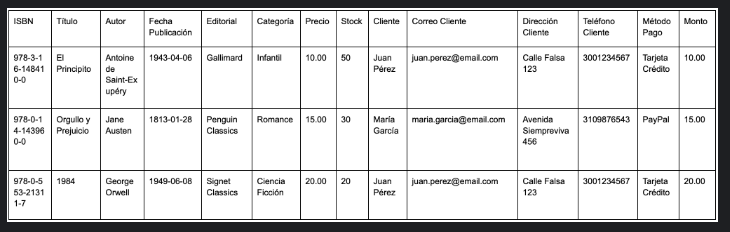

En este examen, diseñarás una base de datos para una tienda de libros que gestione el inventario, ventas y clientes:

Parte 1: Normalización

A continuación, se te proporciona una tabla inicial que contiene información de libros, autores, clientes, pedidos y transacciones. Debes aplicar el proceso de normalización hasta la Tercera Forma Normal (3FN). Presenta cada paso de normalización con su justificación.

Parte 2: Diagrama Conceptual de Entidad-Relación

Utilizando las entidades identificadas en el proceso de normalización, diseña un Diagrama Conceptual de Entidad-Relación (E-R) que represente la estructura lógica de la base de datos de la tienda de libros.

Asegúrate de representar correctamente las relaciones entre las entidades, sus cardinalidades y cualquier restricción necesaria.

Parte 3: Diagrama UML E-R

A partir del diagrama conceptual, crea un Diagrama UML E-R que represente la estructura final de la base de datos de la tienda de libros.

Debes incluir:

Entidades con sus atributos claramente definidos.
Relaciones entre las entidades, especificando las cardinalidades.
Indicaciones de las claves primarias y foráneas.
